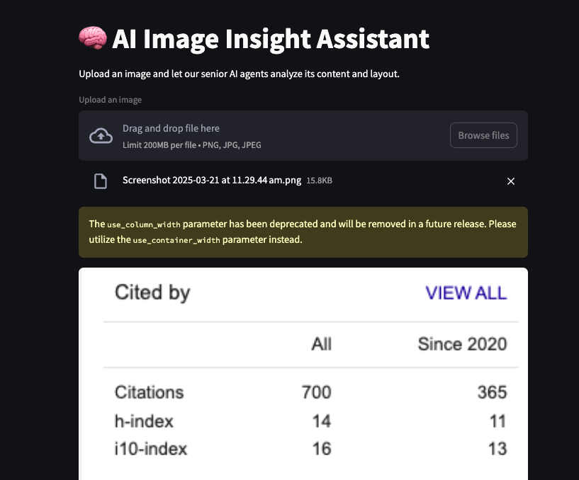

# 🧠 Local Multi-Agent Image Analysis with Open Source Tools
[Local Multi-Agent Image Analysis with Open Source Tools](https://github.com/joaomdmoura/crewAI)

A fully offline, open-source AI system that extracts, interprets, and summarizes insights from any image — graphs, screenshots, dashboards, or photos — using **CrewAI**, **Streamlit**, and **Ollama-powered local LLMs**.



---

## 🖼️ What It Does

- 🧩 Breaks down visual data using **specialized agents** for text extraction, layout analysis, context reasoning, and narrative generation
- 🔍 Detects insights from charts, screenshots, infographics, and more
- 🤖 Simulates human-like understanding using a **multi-agent cognitive pipeline**
- 🔐 Runs entirely **locally** using open-source models — **no API keys, no cloud**

---

## 🧰 Tech Stack

- [CrewAI](https://github.com/joaomdmoura/crewAI) – Multi-agent framework for complex task delegation
- [Ollama](https://ollama.com) – Local LLMs like `gemma`, `phi`, `granite`, `mxbai-embed-large`
- Streamlit – Simple front-end to upload and analyze images
- Langchain + Unstructured – OCR and text extraction from visual files

---

## 📦 Project Structure

```
.
├── app.py               # Streamlit frontend
├── crew.py              # Core logic: agents + tasks
├── tools.py             # Custom tools (OCR, layout detection)
├── config/
│   ├── agents.yaml      # Agent definitions
│   └── tasks.yaml       # Task definitions
├── temp/                # Uploaded images
├── images/              # App images
├── output-files         # Overall flow
├── requirements.txt     # Dependencies
└── README.md
```

---

## ⚙️ How It Works

### 🔹 Agents (`config/agents.yaml`)

Each agent is a specialist with a defined responsibility:

- **Senior Vision-to-Text Specialist** → Extracts readable text from the image
- **Senior Visual Structure Analyst** → Interprets layout and element positions
- **Senior Visual Insight Architect** → Determines what is important and why
- **Senior Insight Narrator** → Produces a high-level human-like narrative

They run entirely on **local LLMs** via Ollama.

### 🔹 Tasks (`config/tasks.yaml`)

Tasks are delegated based on each agent’s strengths:

- Extract text
- Analyze layout
- Determine image context and key elements
- Generate narrative summary

### 🔹 Tools (`tools.py`)

Instead of using `crewai.tools.VisionTool` (which doesn’t work with Ollama/local models), we created **custom tools**:

- `TextExtractionTool` – Uses `UnstructuredImageLoader` for OCR
- `ObjectLocationTool` – Simulates spatial understanding of elements in image

These tools receive the image path and feed insights back to the agents.

---

## 🧠 Crew Execution (`crew.py`)

All agents and tasks are initialized and orchestrated through this function:

```python
def process_image(image_path: str):
    tasks = initialize_tasks(image_path)
    crew = Crew(
        agents=list(agents.values()),
        tasks=tasks,
        verbose=True,
        max_iterations=10,  # Prevent infinite loops
        embedder={"provider": "ollama", "config": {"model": "mxbai-embed-large"}}
    )
    result = crew.kickoff()
    return {
        "tasks_output": [task.output.__dict__ for task in crew.tasks],
        "token_usage": str(crew.usage_metrics),
    }
```

This ensures clean task execution, safe looping, and shared memory between agents via local embedding models.

---

## 🚀 Getting Started

### 1. Clone and Install

```bash
git clone https://github.com/YOUR_USERNAME/local-image-analyzer
cd local-image-analyzer
pip install -r requirements.txt
```

### 2. Start Ollama + Load Models

Make sure [Ollama](https://ollama.com) is installed and running.

Install the models:

```bash
ollama run gemma
ollama run phi
ollama run granite
ollama run mxbai-embed-large
```

### 3. Launch the App

```bash
streamlit run app.py
```

---

## 📝 Sample Output

```
📝 Summary
🔹 Task 1: Text Extraction → Extracted citation metrics
🔹 Task 2: Layout Analysis → Identified grid layout of labels/values
🔹 Task 3: Context Reasoning → Prioritized metrics like h-index, i10-index
🔹 Task 4: Human Summary → Explained citation growth, patterns, and impact
```

---

## 💡 Key Advantages

- **100% local**: No internet connection or OpenAI API key needed — perfect for secure, offline environments.
- **Open-source models**: Full transparency, customizable, and reproducible for enterprise use.
- **Modular YAML config**: Agents and tasks defined declaratively — scalable and clean.
- **Multi-domain ready**: Works with charts, dashboards, web UI, scenes, infographics, and more.

---

## 📈 Built For

- Privacy-sensitive AI research
- Educational analytics projects
- Visual summarization pipelines
- Document intelligence for offline environments

---

## 🧱 Future Work

- Use LayoutLM or vision transformers for real layout analysis
- Add follow-up Q&A on image contents
- Extend to medical, industrial, or legal domains

---

## 🤝 Contributing

PRs welcome! Let’s make local agentic intelligence stronger together.

---

## 📄 License

MIT – do what you want, just give credit.

---

## 🙌 Acknowledgments

- [CrewAI](https://github.com/joaomdmoura/crewAI)
- [Ollama](https://ollama.com)
- Langchain, Unstructured, Streamlit

---

Built with ❤️ for the open-source AI community.
