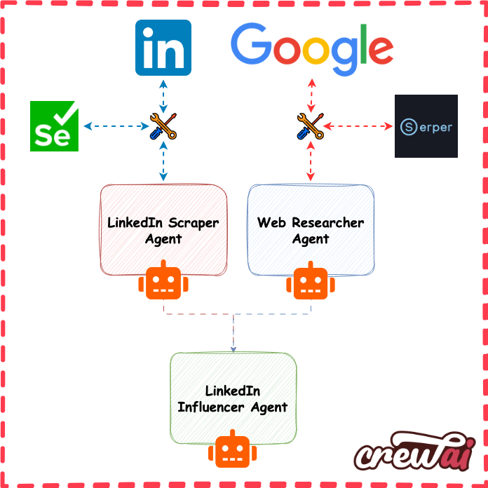

<p align="center">
    
    <h1 align="center">Automating LinkedIn Posts with AgenticAI</h1>
    <h3 align="center">Harnessing crewAI and Ollama for Dynamic LinkedIn Content Creation</h3>
</p>

---


## Overview

This repository showcases an advanced crewAI application designed to automate the creation of LinkedIn posts. Users can input a desired topic, select a professional persona, and choose a tone to generate a structured, engaging LinkedIn post. The application leverages a team of specialized agents to ensure content quality and relevance.

## Key Features

- **Dynamic Topic Input**: Users can specify any topic of interest.
- **Persona Selection**: Tailor the post's perspective by choosing from personas like Data Scientist, Product Manager, or CTO.
- **Tone Adjustment**: Adjust the post's tone to be Optimistic, Neutral, or Bold.
- **Structured Output**: Generated posts follow a consistent format with hooks, implementation steps, and insights.

## Agents Overview

The system comprises the following agents:

1. **LinkedIn Style Scraper**: Scrapes a specified LinkedIn profile to extract writing tone and engagement strategies.
2. **Market Research Analyst**: Gathers the most recent and relevant articles or discussions about the specified topic.
3. **Trend Analyst**: Identifies trending subtopics, hashtags, and public sentiment related to the topic.
4. **Structured LinkedIn Post Writer**: Crafts a professional LinkedIn post in markdown format, incorporating the gathered information and adhering to the selected persona and tone.
5. **Content Quality Assurance Agent**: Reviews the final post for clarity, tone consistency, and overall impact.

## Application Architecture

<p align="center">
    
</p>

The architecture ensures a seamless flow from data collection to content generation, maintaining high-quality output tailored to user specifications.

## Setup and Usage

### Prerequisites

- **Python 3.x**: Ensure you have Python installed.
- **Ollama Server**: The application relies on the Ollama server for LLM services. Ensure it's running at `http://localhost:11434`.
- **Environment Variables**: Create a `.env` file with the necessary environment variables. Refer to `sample.env` for guidance.

### Installation

1. **Clone the Repository**:

   ```bash
   git clone https://github.com/amirgholipour/AgenticAI-with-Ollama.git
   cd AgenticAI-with-Ollama/Linkedin-Post-Creater
   ```

2. **Install Dependencies**:

   ```bash
   pip install -r requirements.txt
   ```

### Running the Application

Execute the Streamlit application:

```bash
streamlit run app.py
```

Upon running, the web interface will prompt you to:

- **Enter a Topic**: Specify the subject of the LinkedIn post.
- **Select a Persona**: Choose the professional perspective (e.g., Data Scientist).
- **Choose a Tone**: Decide on the post's tone (e.g., Optimistic).

After providing the inputs, the system will generate a structured LinkedIn post displayed in markdown format.

## Output Format

The generated LinkedIn posts adhere to the following structure:

```markdown
🔥 **Hook**: Engaging opening line related to the topic.

🛠 **Implementation Steps**:
1️⃣ Step one details...
2️⃣ Step two details...
...

💡 **Insights**:
- 💪 Insight one...
- ✨ Insight two...
...
```

This format ensures clarity, engagement, and consistency across posts.

## Customization

To adapt the application to different use cases:

- **Agents Configuration**: Modify `agents.yaml` to adjust agent roles, goals, and tools.
- **Tasks Configuration**: Update `tasks.yaml` to redefine task descriptions, expected outputs, and agent assignments.

## Acknowledgments

Special thanks to the [crewAI](https://github.com/crewAI/crewAI) team for their foundational work, and to the contributors of this project for their continuous improvements and feature enhancements.

---

For any issues or contributions, please refer to the [GitHub repository](https://github.com/amirgholipour/AgenticAI-with-Ollama/tree/main/Linkedin-Post-Creater).
